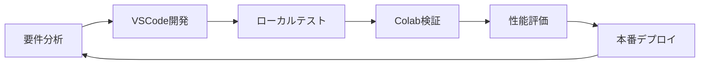

# MapSight_AI 開発フロー完全ガイド

## 概要

MapSight_AIプロジェクトは、VSCode開発環境とGoogle Colab実行環境を組み合わせたハイブリッド開発フローを採用しています。このドキュメントでは、効率的な開発・テスト・運用のための完全なワークフローを説明します。

## プロジェクト構造

```
MapSight_AI/
├── src/                          # コアソースコード
│   ├── segment_rounds_updated.py # ラウンド境界検出
│   ├── clean_same_frames.py      # 重複フレーム削除
│   ├── crop_minimap.py           # マップ切り抜き
│   └── gui/                      # GUI実装
├── data/                         # データディレクトリ
│   ├── frames/                   # 抽出フレーム
│   ├── minimaps/                 # 切り抜きマップ
│   ├── templates/                # テンプレート画像
│   └── raw_videos/               # 元動画
├── docs/                         # ドキュメント
├── tests/                        # テストファイル
├── MapSight_AI_Colab.ipynb       # Colab統合ノートブック
├── config.yaml                   # 設定ファイル
└── requirements.txt              # 依存関係
```

## 開発フロー

### 1. 開発環境準備

#### 1.1 VSCode環境設定

```bash
# プロジェクトクローン/オープン
cd /mnt/c/Users/bi19063/MapSight_AI

# 仮想環境作成
python -m venv venv
source venv/bin/activate  # Linux/WSL
# または venv\Scripts\activate  # Windows

# 依存関係インストール
pip install -r requirements.txt
```

#### 1.2 VSCode設定ファイル適用

`.vscode/settings.json`:
```json
{
    "python.defaultInterpreterPath": "./venv/bin/python",
    "python.linting.enabled": true,
    "python.linting.pylintEnabled": true,
    "python.formatting.provider": "black",
    "python.testing.pytestEnabled": true,
    "files.associations": {
        "*.yaml": "yaml",
        "*.yml": "yaml"
    }
}
```

### 2. 開発プロセス

#### 2.1 機能開発サイクル



#### 2.2 コーディング標準

**ファイル構造:**
```python
#!/usr/bin/env python3
"""
モジュール説明

Author: Your Name
Date: YYYY-MM-DD
"""

import sys
import os
from pathlib import Path
# ...other imports

class ModuleClass:
    """クラス説明"""
    
    def __init__(self):
        self.config = self._load_config()
    
    def main_function(self):
        """メイン処理"""
        pass

if __name__ == "__main__":
    # 実行コード
    pass
```

### 3. Colab統合ワークフロー

#### 3.1 Colab環境初期化

1. **Google Driveマウント**
```python
from google.colab import drive
drive.mount('/content/drive')
```

2. **プロジェクト同期**
```python
import shutil
import os

# ローカルからColabへの同期
def sync_to_colab():
    local_path = "/content/drive/MyDrive/MapSight_AI"
    if not os.path.exists(local_path):
        os.makedirs(local_path)
    
    # 必要ファイルをコピー
    files_to_sync = [
        "src/",
        "config.yaml", 
        "requirements.txt"
    ]
    
    for file_path in files_to_sync:
        # 同期処理
        pass
```

#### 3.2 Colab実行パターン

**パターン1: 完全処理**
```python
# MapSight_AI_Colab.ipynb の全セクション実行
# 1. 環境初期化
# 2. データ準備
# 3. フレーム抽出
# 4. マップ切り抜き
# 5. 重複削除
# 6. ラウンド検出
# 7. 結果検証
```

**パターン2: 特定機能テスト**
```python
# 特定セクションのみ実行
%run section_4_crop_minimap.py
```

### 4. テスト戦略

#### 4.1 テスト階層

```
Unit Tests (個別機能)
├── test_clean_same_frames.py
├── test_segment_rounds.py
└── test_crop_minimap.py

Integration Tests (統合)
├── Colab環境での統合テスト
└── エンドツーエンドテスト

Performance Tests (性能)
├── 処理時間測定
├── メモリ使用量測定
└── GPU利用率測定
```

#### 4.2 テスト実行

**ローカル環境:**
```bash
# 単体テスト
pytest tests/ -v

# カバレッジ測定
pytest --cov=src tests/

# 性能テスト
python -m pytest tests/test_performance.py --benchmark-only
```

**Colab環境:**
```python
# Colabでのテスト実行
!cd /content/drive/MyDrive/MapSight_AI && python -m pytest tests/ -v
```

### 5. データ管理フロー

#### 5.1 データディレクトリ構造

```
data/
├── raw_videos/           # 元動画 (入力)
│   └── {video_id}.mp4
├── frames/              # 抽出フレーム
│   └── {date}/
│       └── frame_{index:05d}.jpg
├── minimaps/            # 切り抜きマップ
│   └── {date}/
│       └── minimap_{index:05d}.jpg
├── templates/           # テンプレート画像
│   └── Match_End_template.jpg
└── deleted_frames/      # 削除フレーム (バックアップ)
    └── {date}/
```

#### 5.2 データ同期システム

**VSCode → Colab:**
```python
def upload_to_colab(local_dir, colab_dir):
    """ローカルデータをColabにアップロード"""
    # Google Drive API使用
    pass

def download_from_colab(colab_dir, local_dir):
    """Colab結果をローカルにダウンロード"""
    # 結果ファイルの取得
    pass
```

### 6. 品質管理

#### 6.1 コード品質チェック

**pre-commit設定 (`.pre-commit-config.yaml`):**
```yaml
repos:
  - repo: https://github.com/psf/black
    rev: 22.3.0
    hooks:
      - id: black
  - repo: https://github.com/pycqa/flake8
    rev: 4.0.1
    hooks:
      - id: flake8
  - repo: https://github.com/pycqa/isort
    rev: 5.10.1
    hooks:
      - id: isort
```

#### 6.2 性能監視

**監視項目:**
- 処理時間 (フレーム/秒)
- メモリ使用量 (MB)
- GPU利用率 (%)
- 検出精度 (Precision/Recall)

### 7. 設定管理

#### 7.1 環境別設定

**config.yaml:**
```yaml
# 環境設定
environment:
  current: "development"  # development, colab, production
  
  development:
    data_dir: "/mnt/c/Users/bi19063/MapSight_AI/data"
    max_workers: 4
    gpu_enabled: false
  
  colab:
    data_dir: "/content/drive/MyDrive/MapSight_AI/data"
    max_workers: 2
    gpu_enabled: true
  
  production:
    data_dir: "/production/data"
    max_workers: 8
    gpu_enabled: true

# 処理設定
processing:
  segment_rounds:
    template_threshold: 0.5
    cluster_gap: 5
    ocr_enabled: true
  
  clean_frames:
    phash_threshold: 5
    ahash_threshold: 10
  
  crop_minimap:
    perspective_transform: true
    output_size: [200, 200]
```

#### 7.2 設定読み込み

```python
import yaml
from pathlib import Path

class ConfigManager:
    def __init__(self, config_path="config.yaml"):
        self.config_path = Path(config_path)
        self.config = self._load_config()
    
    def _load_config(self):
        with open(self.config_path, 'r', encoding='utf-8') as f:
            return yaml.safe_load(f)
    
    def get_env_config(self, env=None):
        if env is None:
            env = self.config['environment']['current']
        return self.config['environment'][env]
```

### 8. トラブルシューティング

#### 8.1 共通問題と解決策

**問題1: パス関連エラー**
```python
# 解決策: 環境検出とパス正規化
import os
import platform

def get_project_root():
    if 'COLAB_GPU' in os.environ:
        return Path("/content/drive/MyDrive/MapSight_AI")
    else:
        return Path(__file__).parent.parent
```

**問題2: メモリ不足**
```python
# 解決策: バッチ処理
def process_frames_in_batches(frames, batch_size=100):
    for i in range(0, len(frames), batch_size):
        batch = frames[i:i+batch_size]
        process_batch(batch)
        # メモリクリア
        gc.collect()
```

**問題3: GPU利用問題**
```python
# 解決策: デバイス検出と切り替え
import torch

def get_device():
    if torch.cuda.is_available():
        return torch.device('cuda')
    else:
        return torch.device('cpu')
```

### 9. デバッグワークフロー

#### 9.1 デバッグ手順

1. **問題特定**
```bash
# エラーログ確認
tail -f logs/error.log

# テスト実行
pytest tests/test_specific_module.py -v -s
```

2. **VSCodeデバッグ**
```json
// .vscode/launch.json
{
    "version": "0.2.0",
    "configurations": [
        {
            "name": "Debug Segment Rounds",
            "type": "python",
            "request": "launch",
            "program": "src/segment_rounds_updated.py",
            "args": ["--debug", "--frames-dir", "data/frames/2025-05-02"],
            "console": "integratedTerminal"
        }
    ]
}
```

3. **Colabデバッグ**
```python
# デバッグフラグ付きで実行
debug_mode = True
if debug_mode:
    import pdb; pdb.set_trace()
```

#### 9.2 ログ管理

```python
import logging
from pathlib import Path

def setup_logger(name, log_file, level=logging.INFO):
    """ロガー設定"""
    formatter = logging.Formatter(
        '%(asctime)s %(levelname)s %(name)s: %(message)s'
    )
    
    handler = logging.FileHandler(log_file)
    handler.setFormatter(formatter)
    
    logger = logging.getLogger(name)
    logger.setLevel(level)
    logger.addHandler(handler)
    
    return logger
```

### 10. リリースプロセス

#### 10.1 バージョン管理

**セマンティックバージョニング:**
- `MAJOR.MINOR.PATCH`
- `1.0.0` → `1.0.1` (バグフィックス)
- `1.0.1` → `1.1.0` (機能追加)
- `1.1.0` → `2.0.0` (破壊的変更)

#### 10.2 リリース手順

1. **機能完成**
2. **テスト完了**
3. **ドキュメント更新**
4. **バージョンタグ作成**
5. **リリースノート作成**

### 11. 性能最適化

#### 11.1 最適化チェックリスト

- [ ] 並列処理の活用
- [ ] GPU処理の適用
- [ ] メモリ効率化
- [ ] アルゴリズム最適化
- [ ] キャッシュ活用

#### 11.2 ベンチマーク

```python
import time
import psutil
import GPUtil

class PerformanceMonitor:
    def __init__(self):
        self.start_time = None
        self.start_memory = None
    
    def start(self):
        self.start_time = time.time()
        self.start_memory = psutil.virtual_memory().used
    
    def stop(self):
        duration = time.time() - self.start_time
        memory_used = psutil.virtual_memory().used - self.start_memory
        
        gpu_info = GPUtil.getGPUs()
        gpu_usage = gpu_info[0].load if gpu_info else 0
        
        return {
            'duration': duration,
            'memory_mb': memory_used / 1024 / 1024,
            'gpu_usage': gpu_usage
        }
```

### 12. 将来的な拡張

#### 12.1 技術ロードマップ

**Phase 1 (短期):**
- OCR機能統合
- デバッグ機能強化
- 設定ファイル対応

**Phase 2 (中期):**
- 機械学習分類器
- GPU加速実装
- Web API化

**Phase 3 (長期):**
- リアルタイム処理
- 高度な可視化機能
- 自動チューニング機能

#### 12.2 アーキテクチャ進化

```python
# 将来のアーキテクチャ案
class MapSightAI:
    def __init__(self):
        self.pipeline = ProcessingPipeline([
            FrameExtractor(),
            DuplicateRemover(),
            MinimapCropper(),
            RoundSegmenter(),
            MLClassifier(),  # 将来追加
            OCRProcessor(),  # 将来追加
        ])
    
    async def process_video(self, video_path):
        return await self.pipeline.run(video_path)
```

## まとめ

このドキュメントは、MapSight_AIプロジェクトの完全な開発フローを説明しています。VSCodeとColabの組み合わせにより、効率的な開発・テスト・運用が可能になります。

定期的にこのドキュメントを更新し、プロジェクトの進化に合わせて開発フローを改善していくことが重要です。
