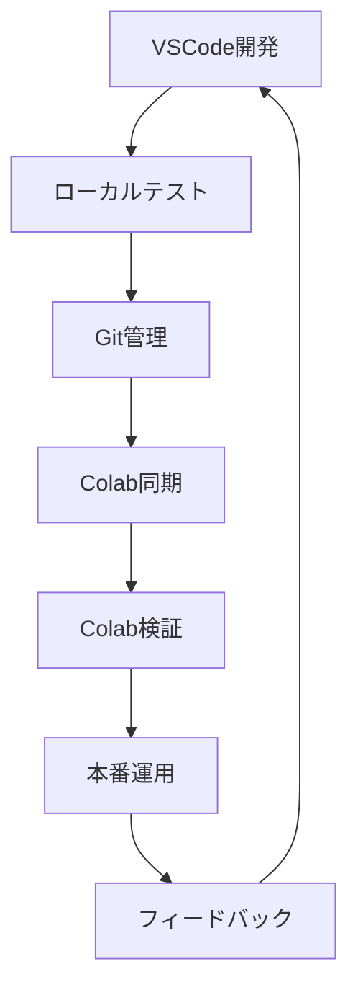

# MapSight_AI 開発ワークフロー

## 概要

MapSight_AIプロジェクトでは、VSCodeでの開発とGoogle Colabでのテスト・運用を組み合わせたハイブリッド開発フローを採用しています。このドキュメントでは、効率的な開発手順と注意点について説明します。

## 🔄 開発フロー概要



### 基本的な役割分担

| 環境 | 用途 | 利点 |
|------|------|------|
| **VSCode** | コード開発・デバッグ | エディタ機能、拡張機能、Git統合 |
| **Google Colab** | テスト・運用・実験 | GPU利用、環境統一、共有しやすさ |

## 📁 プロジェクト構成

### ディレクトリ構造

```
MapSight_AI/
├── src/                        # 開発コード（VSCode）
│   ├── segment_rounds.py
│   ├── crop_minimap.py
│   ├── clean_same_frames.py
│   └── utils.py
├── notebooks/                  # Colabノートブック
│   ├── dev_test.ipynb          # 開発用テスト
│   ├── production.ipynb        # 本番用
│   └── experiments/            # 実験用
├── tests/                      # ユニットテスト
│   ├── test_segment.py
│   ├── test_crop.py
│   └── test_data/
├── docs/                       # ドキュメント
│   ├── DEVELOPMENT_WORKFLOW.md
│   └── API_REFERENCE.md
├── config/                     # 設定ファイル
│   ├── dev_config.yaml
│   ├── colab_config.yaml
│   └── production_config.yaml
├── requirements/               # 依存関係
│   ├── requirements_dev.txt
│   ├── requirements_colab.txt
│   └── requirements_base.txt
└── utils/                      # 共通ユーティリティ
    ├── path_manager.py
    ├── env_checker.py
    └── data_sync.py
```

## 🛠️ 開発環境セットアップ

### VSCode開発環境

#### 1. 必要な拡張機能

```json
// .vscode/extensions.json
{
    "recommendations": [
        "ms-python.python",
        "ms-python.black-formatter",
        "ms-python.flake8",
        "ms-toolsai.jupyter",
        "ms-vscode.test-adapter-converter",
        "github.copilot"
    ]
}
```

#### 2. 設定ファイル

```json
// .vscode/settings.json
{
    "python.defaultInterpreterPath": "./venv/bin/python",
    "python.testing.pytestEnabled": true,
    "python.testing.pytestArgs": ["tests"],
    "python.formatting.provider": "black",
    "python.linting.flake8Enabled": true,
    "files.exclude": {
        "**/__pycache__": true,
        "**/.*": false
    }
}
```

#### 3. 仮想環境設定

```bash
# 仮想環境作成
python -m venv venv
source venv/bin/activate  # Linux/Mac
# venv\Scripts\activate  # Windows

# 開発用依存関係インストール
pip install -r requirements/requirements_dev.txt
```

### 環境互換性管理

#### パス管理システム

```python
# utils/path_manager.py
import os
from pathlib import Path

class PathManager:
    """VSCodeとColab環境のパス管理"""
    
    def __init__(self):
        self.is_colab = self._detect_colab()
        self.setup_environment()
    
    def _detect_colab(self):
        """Colab環境の検出"""
        try:
            import google.colab
            return True
        except ImportError:
            return False
    
    def setup_environment(self):
        """環境に応じたパス設定"""
        if self.is_colab:
            self.base_path = Path("/content/drive/MyDrive/MapSight_AI")
            self._ensure_colab_setup()
        else:
            # ローカル環境（VSCode）
            self.base_path = Path(__file__).parent.parent
    
    def _ensure_colab_setup(self):
        """Colab環境の初期設定確認"""
        if not self.base_path.exists():
            raise RuntimeError(
                "Google Drive not mounted or MapSight_AI not found. "
                "Please run: drive.mount('/content/drive')"
            )
    
    def get_path(self, relative_path: str) -> Path:
        """環境に応じた絶対パスを返す"""
        return self.base_path / relative_path
    
    def frames_dir(self, date: str) -> Path:
        """フレームディレクトリパス"""
        return self.get_path(f"data/frames/{date}")
    
    def template_path(self, template_name: str = "Match_End_template.jpg") -> Path:
        """テンプレートファイルパス"""
        return self.get_path(f"data/templates/{template_name}")
    
    def output_dir(self, date: str) -> Path:
        """出力ディレクトリパス"""
        return self.get_path(f"data/{date}")
    
    def config_path(self, config_name: str = "config.yaml") -> Path:
        """設定ファイルパス"""
        if self.is_colab:
            return self.get_path(f"config/colab_{config_name}")
        else:
            return self.get_path(f"config/dev_{config_name}")

# 使用例
pm = PathManager()
frames = pm.frames_dir("2025-06-10")
template = pm.template_path()
config = pm.config_path()
```

#### 環境依存関係管理

```python
# utils/env_checker.py
import sys
import subprocess
import importlib
from typing import Dict, List, Tuple

class EnvironmentChecker:
    """環境依存関係の確認と管理"""
    
    def __init__(self):
        self.is_colab = 'google.colab' in sys.modules
        self.required_packages = self._load_requirements()
    
    def _load_requirements(self) -> Dict[str, str]:
        """環境に応じた要求パッケージの読み込み"""
        if self.is_colab:
            req_file = "requirements/requirements_colab.txt"
        else:
            req_file = "requirements/requirements_dev.txt"
        
        requirements = {}
        try:
            with open(req_file, 'r') as f:
                for line in f:
                    line = line.strip()
                    if line and not line.startswith('#'):
                        if '==' in line:
                            package, version = line.split('==')
                            requirements[package] = version
                        else:
                            requirements[line] = None
        except FileNotFoundError:
            print(f"Warning: {req_file} not found")
        
        return requirements
    
    def check_environment(self) -> Tuple[List[str], List[str]]:
        """環境チェック実行"""
        missing_packages = []
        version_mismatches = []
        
        for package, required_version in self.required_packages.items():
            try:
                imported_module = importlib.import_module(package)
                if required_version:
                    installed_version = getattr(imported_module, '__version__', None)
                    if installed_version != required_version:
                        version_mismatches.append(
                            f"{package}: required {required_version}, "
                            f"installed {installed_version}"
                        )
            except ImportError:
                missing_packages.append(package)
        
        return missing_packages, version_mismatches
    
    def install_missing_packages(self, packages: List[str]):
        """不足パッケージの自動インストール"""
        if not packages:
            return
        
        if self.is_colab:
            for package in packages:
                version = self.required_packages.get(package)
                if version:
                    install_cmd = f"pip install {package}=={version}"
                else:
                    install_cmd = f"pip install {package}"
                
                print(f"Installing: {install_cmd}")
                subprocess.run(install_cmd.split(), check=True)
        else:
            print("Please install missing packages manually:")
            for package in packages:
                version = self.required_packages.get(package)
                if version:
                    print(f"  pip install {package}=={version}")
                else:
                    print(f"  pip install {package}")
    
    def setup_colab_environment(self):
        """Colab環境の初期設定"""
        if not self.is_colab:
            return
        
        # Google Drive マウント
        try:
            from google.colab import drive
            drive.mount('/content/drive')
            print("✓ Google Drive mounted")
        except Exception as e:
            print(f"✗ Failed to mount Google Drive: {e}")
        
        # システムレベルの依存関係
        system_packages = ['ffmpeg']
        for package in system_packages:
            try:
                subprocess.run(['apt-get', 'install', '-y', package], 
                             check=True, capture_output=True)
                print(f"✓ {package} installed")
            except subprocess.CalledProcessError as e:
                print(f"✗ Failed to install {package}: {e}")
        
        # Python パッケージチェック
        missing, mismatches = self.check_environment()
        if missing:
            print(f"Installing missing packages: {missing}")
            self.install_missing_packages(missing)
        
        if mismatches:
            print("Version mismatches detected:")
            for mismatch in mismatches:
                print(f"  {mismatch}")

# 使用例
checker = EnvironmentChecker()
if checker.is_colab:
    checker.setup_colab_environment()
else:
    missing, mismatches = checker.check_environment()
    if missing or mismatches:
        print("Environment issues detected. Please resolve them.")
```

## 🔧 開発ワークフロー

### Daily Development Flow

#### 1. 朝の準備（VSCode）

```bash
# 1. 最新コードの取得
git pull origin main

# 2. 仮想環境の有効化
source venv/bin/activate

# 3. 依存関係の確認
python utils/env_checker.py

# 4. ブランチ作成（新機能の場合）
git checkout -b feature/new-functionality
```

#### 2. 開発作業（VSCode）

```python
# 開発時の基本テンプレート
from utils.path_manager import PathManager
from utils.env_checker import EnvironmentChecker

def main():
    # 環境初期化
    pm = PathManager()
    checker = EnvironmentChecker()
    
    # 機能実装
    # ...existing code...
    
    # ローカルテスト
    test_result = run_local_tests()
    if not test_result:
        print("Tests failed. Please fix before committing.")
        return False
    
    return True

if __name__ == "__main__":
    main()
```

#### 3. ローカルテスト（VSCode）

```python
# tests/test_integration.py
import unittest
import sys
import os
sys.path.append(os.path.join(os.path.dirname(__file__), '..', 'src'))

from utils.path_manager import PathManager
from segment_rounds_updated import *

class TestIntegration(unittest.TestCase):
    def setUp(self):
        self.pm = PathManager()
        # 小規模テストデータ
        self.test_frames = self.pm.get_path("tests/test_data/frames")
        self.test_template = self.pm.get_path("tests/test_data/template.jpg")
    
    def test_path_compatibility(self):
        """パス管理の互換性テスト"""
        frames_path = self.pm.frames_dir("2025-06-10")
        self.assertTrue(isinstance(frames_path, Path))
    
    def test_ahash_calculation(self):
        """aHash計算のテスト"""
        if self.test_frames.exists():
            frame_files = list(self.test_frames.glob("*.jpg"))
            if frame_files:
                hash_val = ahash(frame_files[0])
                self.assertIsInstance(hash_val, int)
                self.assertGreater(hash_val, 0)
    
    def test_colab_simulation(self):
        """Colab環境シミュレーション"""
        # Colabパスの模擬
        colab_base = "/tmp/test_colab"
        os.makedirs(colab_base, exist_ok=True)
        
        # パス変換テスト
        local_path = str(self.pm.base_path / "data")
        expected_colab = colab_base + "/data"
        # テスト実装
        
    def test_small_dataset_processing(self):
        """小規模データでの処理テスト"""
        if self.test_frames.exists() and self.test_template.exists():
            # 実際の処理を小規模データで実行
            result = process_small_dataset(
                self.test_frames, 
                self.test_template,
                dry_run=True
            )
            self.assertIsNotNone(result)

def run_local_tests():
    """ローカルテストの実行"""
    loader = unittest.TestLoader()
    suite = loader.discover('tests', pattern='test_*.py')
    runner = unittest.TextTestRunner(verbosity=2)
    result = runner.run(suite)
    return result.wasSuccessful()

if __name__ == '__main__':
    unittest.main()
```

#### 4. Git管理（VSCode）

```bash
# コミット前のチェック
# 1. フォーマッタ実行
black src/ tests/

# 2. リンター実行
flake8 src/ tests/

# 3. テスト実行
python -m pytest tests/ -v

# 4. コミット
git add .
git commit -m "feat: add new functionality for round detection

- Implement enhanced template matching
- Add path compatibility for Colab
- Update tests for new features

Closes #123"

# 5. プッシュ
git push origin feature/new-functionality
```

### Colab Integration Flow

#### 1. 開発用テストノートブック

```python
# notebooks/dev_test.ipynb

# Cell 1: 環境セットアップ
import sys
import os

# プロジェクト同期
if not os.path.exists('/content/MapSight_AI'):
    !git clone https://github.com/your-repo/MapSight_AI.git /content/MapSight_AI

%cd /content/MapSight_AI

# 環境チェックと初期化
from utils.env_checker import EnvironmentChecker
from utils.path_manager import PathManager

checker = EnvironmentChecker()
checker.setup_colab_environment()

pm = PathManager()
print(f"Project base: {pm.base_path}")

# Cell 2: 機能テスト
# 最新コードのテスト
from src.segment_rounds_updated import *

# 小規模データでのテスト
test_frames_dir = "/content/drive/MyDrive/MapSight_AI/data/frames/test_small"
test_template = "/content/drive/MyDrive/MapSight_AI/data/templates/Match_End_template.jpg"

if os.path.exists(test_frames_dir) and os.path.exists(test_template):
    print("Running small-scale test...")
    result = segment_rounds_colab(
        test_frames_dir,
        test_template,
        segments=3,
        dry_run=True
    )
    print(f"Test result: {result}")
else:
    print("Test data not found. Please upload test data.")

# Cell 3: 性能ベンチマーク
import time
import psutil

def benchmark_processing():
    """処理性能のベンチマーク"""
    start_time = time.time()
    start_memory = psutil.virtual_memory().used
    
    # 実際の処理
    # result = your_processing_function()
    
    end_time = time.time()
    end_memory = psutil.virtual_memory().used
    
    processing_time = end_time - start_time
    memory_used = (end_memory - start_memory) / 1024 / 1024  # MB
    
    print(f"Processing time: {processing_time:.2f}s")
    print(f"Memory used: {memory_used:.2f}MB")
    
    return processing_time, memory_used

# GPU利用状況確認
import torch
if torch.cuda.is_available():
    print(f"GPU: {torch.cuda.get_device_name(0)}")
    print(f"GPU Memory: {torch.cuda.get_device_properties(0).total_memory / 1e9:.1f}GB")
    
    # GPU使用量モニタリング
    torch.cuda.empty_cache()
    memory_before = torch.cuda.memory_allocated()
    
    # 処理実行
    benchmark_processing()
    
    memory_after = torch.cuda.memory_allocated()
    gpu_memory_used = (memory_after - memory_before) / 1024 / 1024  # MB
    print(f"GPU Memory used: {gpu_memory_used:.2f}MB")

# Cell 4: エラーハンドリングテスト
def test_error_scenarios():
    """エラーシナリオのテスト"""
    scenarios = [
        ("Invalid template path", "/invalid/path/template.jpg"),
        ("Empty frames directory", "/content/empty_dir"),
        ("Corrupted image file", "/content/corrupted.jpg"),
    ]
    
    for scenario_name, test_input in scenarios:
        try:
            print(f"\nTesting: {scenario_name}")
            # テスト実行
            # result = your_function(test_input)
            print("✓ Handled gracefully")
        except Exception as e:
            print(f"✗ Error: {e}")

test_error_scenarios()
```

#### 2. 本番運用ノートブック

```python
# notebooks/production.ipynb

# Cell 1: 本番環境セットアップ
from google.colab import drive
import os
import time
import signal
import threading

# Google Drive マウント
drive.mount('/content/drive')

# プロジェクト最新版の取得
%cd /content
!rm -rf MapSight_AI  # 既存削除
!git clone https://github.com/your-repo/MapSight_AI.git
%cd MapSight_AI

# セッション維持機能
def keep_session_alive():
    """Colabセッション維持"""
    while True:
        time.sleep(300)  # 5分間隔
        print(".", end="", flush=True)

# バックグラウンドでセッション維持
keep_alive_thread = threading.Thread(target=keep_session_alive, daemon=True)
keep_alive_thread.start()

# Cell 2: 本番処理実行
from utils.path_manager import PathManager
from utils.env_checker import EnvironmentChecker
from src.segment_rounds_updated import *

# 環境初期化
checker = EnvironmentChecker()
checker.setup_colab_environment()

pm = PathManager()

# 設定読み込み
config_path = pm.config_path("production_config.yaml")
with open(config_path, 'r') as f:
    config = yaml.safe_load(f)

print("=== MapSight_AI Production Run ===")
print(f"Config: {config}")

# Cell 3: データ処理実行
def run_production_pipeline(video_date: str, config: dict):
    """本番処理パイプライン"""
    
    # チェックポイント機能
    checkpoint_file = pm.get_path(f"data/checkpoints/{video_date}_checkpoint.pkl")
    
    try:
        # 1. フレーム確認
        frames_dir = pm.frames_dir(video_date)
        if not frames_dir.exists():
            raise FileNotFoundError(f"Frames directory not found: {frames_dir}")
        
        frames = list(frames_dir.glob("*.jpg"))
        print(f"Found {len(frames)} frames")
        
        # 2. テンプレート確認
        template_path = pm.template_path()
        if not template_path.exists():
            raise FileNotFoundError(f"Template not found: {template_path}")
        
        # 3. 処理実行
        print("Starting round segmentation...")
        start_time = time.time()
        
        boundaries = segment_rounds_colab(
            str(frames_dir),
            str(template_path),
            segments=config.get('segments', 5),
            end_th=config.get('threshold', 0.5),
            step=config.get('step', 1),
            dry_run=False
        )
        
        end_time = time.time()
        processing_time = end_time - start_time
        
        # 4. 結果保存
        result = {
            'video_date': video_date,
            'boundaries': boundaries,
            'processing_time': processing_time,
            'config': config,
            'timestamp': time.time()
        }
        
        result_file = pm.get_path(f"data/results/{video_date}_result.json")
        result_file.parent.mkdir(exist_ok=True)
        
        with open(result_file, 'w') as f:
            json.dump(result, f, indent=2)
        
        print(f"✓ Processing completed in {processing_time:.2f}s")
        print(f"✓ Results saved to {result_file}")
        
        return result
        
    except Exception as e:
        print(f"✗ Error occurred: {e}")
        
        # エラー情報保存
        error_file = pm.get_path(f"data/errors/{video_date}_error.log")
        error_file.parent.mkdir(exist_ok=True)
        
        with open(error_file, 'w') as f:
            f.write(f"Error: {e}\n")
            f.write(f"Time: {time.time()}\n")
            f.write(f"Config: {config}\n")
        
        raise

# 実行
video_date = "2025-06-10"  # 処理対象日付
result = run_production_pipeline(video_date, config)

# Cell 4: 結果確認と可視化
import matplotlib.pyplot as plt

def visualize_results(result):
    """結果の可視化"""
    boundaries = result['boundaries']
    video_date = result['video_date']
    
    # 境界の可視化
    plt.figure(figsize=(12, 6))
    plt.scatter(boundaries, [1]*len(boundaries), s=100, c='red', marker='|')
    plt.title(f"Round Boundaries - {video_date}")
    plt.xlabel("Frame Index")
    plt.ylabel("Detected Boundaries")
    plt.grid(True)
    plt.show()
    
    # 統計情報
    segments_length = []
    prev = 0
    for boundary in boundaries + [result.get('total_frames', max(boundaries)+100)]:
        segments_length.append(boundary - prev)
        prev = boundary
    
    plt.figure(figsize=(10, 6))
    plt.bar(range(len(segments_length)), segments_length)
    plt.title(f"Segment Lengths - {video_date}")
    plt.xlabel("Round Number")
    plt.ylabel("Number of Frames")
    plt.grid(True)
    plt.show()
    
    print(f"Average segment length: {sum(segments_length)/len(segments_length):.1f} frames")
    print(f"Total processing time: {result['processing_time']:.2f} seconds")

if 'result' in locals():
    visualize_results(result)
```

## ⚠️ 重要な注意点

### 1. 環境差異対応

| 課題 | VSCode | Google Colab | 対応策 |
|------|--------|--------------|--------|
| **パス区切り** | `\` (Windows) | `/` (Linux) | `pathlib.Path`使用 |
| **ベースパス** | ローカルパス | `/content/drive/...` | `PathManager`クラス |
| **GPU利用** | 限定的 | Tesla T4/V100 | 動的GPU検出 |
| **セッション** | 永続的 | 12時間制限 | 自動セッション維持 |

### 2. データ同期管理

```python
# utils/data_sync.py
import shutil
import hashlib
from pathlib import Path

class DataSyncManager:
    """ローカルとColab間のデータ同期管理"""
    
    def __init__(self, pm: PathManager):
        self.pm = pm
        self.sync_manifest = pm.get_path("data/.sync_manifest.json")
    
    def calculate_file_hash(self, file_path: Path) -> str:
        """ファイルハッシュ計算"""
        hash_md5 = hashlib.md5()
        with open(file_path, "rb") as f:
            for chunk in iter(lambda: f.read(4096), b""):
                hash_md5.update(chunk)
        return hash_md5.hexdigest()
    
    def create_sync_manifest(self, directories: list):
        """同期マニフェスト作成"""
        manifest = {}
        
        for directory in directories:
            dir_path = self.pm.get_path(directory)
            if dir_path.exists():
                for file_path in dir_path.rglob("*"):
                    if file_path.is_file():
                        relative_path = str(file_path.relative_to(self.pm.base_path))
                        manifest[relative_path] = {
                            'hash': self.calculate_file_hash(file_path),
                            'size': file_path.stat().st_size,
                            'modified': file_path.stat().st_mtime
                        }
        
        with open(self.sync_manifest, 'w') as f:
            json.dump(manifest, f, indent=2)
        
        return manifest
    
    def validate_sync(self) -> dict:
        """同期状態の検証"""
        if not self.sync_manifest.exists():
            return {'status': 'no_manifest'}
        
        with open(self.sync_manifest, 'r') as f:
            manifest = json.load(f)
        
        missing_files = []
        hash_mismatches = []
        
        for file_path, file_info in manifest.items():
            full_path = self.pm.base_path / file_path
            
            if not full_path.exists():
                missing_files.append(file_path)
            else:
                current_hash = self.calculate_file_hash(full_path)
                if current_hash != file_info['hash']:
                    hash_mismatches.append(file_path)
        
        return {
            'status': 'checked',
            'missing_files': missing_files,
            'hash_mismatches': hash_mismatches
        }
```

### 3. Git管理戦略

```bash
# .gitignore 設定
# 大容量ファイル
data/frames/
data/minimaps/
data/raw_videos/
*.mp4
*.avi

# 中間ファイル
*.pkl
*.tmp
checkpoints/

# 環境固有
.vscode/settings.json
.colab_config
__pycache__/
*.pyc

# ログファイル
logs/
*.log

# Jupyter
.ipynb_checkpoints/
```

```bash
# Git LFS設定（大容量ファイル管理）
git lfs install
git lfs track "*.jpg"
git lfs track "*.png"
git lfs track "*.pkl"
git lfs track "data/templates/*"
```

### 4. セキュリティ・プライバシー

```python
# config/security_config.py
import os
from cryptography.fernet import Fernet

class SecurityManager:
    """機密情報の管理"""
    
    def __init__(self):
        self.key = self._get_or_create_key()
        self.cipher = Fernet(self.key)
    
    def _get_or_create_key(self):
        """暗号化キーの取得または作成"""
        key_file = "config/.security_key"
        
        if os.path.exists(key_file):
            with open(key_file, 'rb') as f:
                return f.read()
        else:
            key = Fernet.generate_key()
            with open(key_file, 'wb') as f:
                f.write(key)
            return key
    
    def encrypt_sensitive_data(self, data: str) -> str:
        """機密データの暗号化"""
        return self.cipher.encrypt(data.encode()).decode()
    
    def decrypt_sensitive_data(self, encrypted_data: str) -> str:
        """機密データの復号化"""
        return self.cipher.decrypt(encrypted_data.encode()).decode()
```

## 📅 推奨開発スケジュール

### Daily Schedule

- **09:00-12:00**: VSCodeでの新機能開発
- **13:00-15:00**: ユニットテスト・デバッグ
- **15:00-17:00**: Colabでの統合テスト
- **17:00-18:00**: ドキュメント更新・Git管理

### Weekly Cycle

| 曜日 | 主な作業 | 環境 |
|------|----------|------|
| **月曜日** | 機能開発・実装 | VSCode |
| **火曜日** | テスト・デバッグ | VSCode + Colab |
| **水曜日** | 性能最適化・GPU実験 | Colab |
| **木曜日** | ドキュメント・リファクタ | VSCode |
| **金曜日** | 統合テスト・リリース準備 | Colab |

## 🔍 品質管理

### Code Quality Checks

```bash
# pre-commit フック設定
# .pre-commit-config.yaml
repos:
  - repo: https://github.com/psf/black
    rev: 23.3.0
    hooks:
      - id: black
        language_version: python3
  
  - repo: https://github.com/pycqa/flake8
    rev: 6.0.0
    hooks:
      - id: flake8
        args: [--max-line-length=88]
  
  - repo: https://github.com/pre-commit/pre-commit-hooks
    rev: v4.4.0
    hooks:
      - id: trailing-whitespace
      - id: end-of-file-fixer
      - id: check-yaml
      - id: check-json
```

### Performance Monitoring

```python
# utils/performance_monitor.py
import time
import psutil
import functools
from typing import Callable, Any

def monitor_performance(func: Callable) -> Callable:
    """パフォーマンス監視デコレータ"""
    
    @functools.wraps(func)
    def wrapper(*args, **kwargs) -> Any:
        # 開始時の状態
        start_time = time.time()
        start_memory = psutil.virtual_memory().used
        
        # 関数実行
        result = func(*args, **kwargs)
        
        # 終了時の状態
        end_time = time.time()
        end_memory = psutil.virtual_memory().used
        
        # 統計情報
        execution_time = end_time - start_time
        memory_diff = (end_memory - start_memory) / 1024 / 1024  # MB
        
        print(f"Function: {func.__name__}")
        print(f"Execution time: {execution_time:.2f}s")
        print(f"Memory change: {memory_diff:+.2f}MB")
        
        return result
    
    return wrapper

# 使用例
@monitor_performance
def segment_rounds_monitored(*args, **kwargs):
    return segment_rounds_colab(*args, **kwargs)
```

## 🚀 Tips & Best Practices

### 開発効率化

1. **VSCode拡張機能活用**
   - Python Docstring Generator
   - GitLens
   - Remote Development

2. **Colab高速化**
   - GPU利用最大化
   - 並列処理活用
   - メモリ効率化

3. **デバッグ戦略**
   - 小規模データでの検証
   - ステップ実行
   - ログ出力の活用

### トラブルシューティング

1. **環境問題**
   ```python
   # 環境診断スクリプト
   python utils/env_checker.py --diagnose
   ```

2. **同期問題**
   ```python
   # 同期状態確認
   python utils/data_sync.py --validate
   ```

3. **性能問題**
   ```python
   # ベンチマーク実行
   python utils/performance_monitor.py --benchmark
   ```

この開発ワークフローにより、VSCodeの開発効率とGoogle Colabの計算リソースを最適に組み合わせ、効率的な開発サイクルを実現できます。
