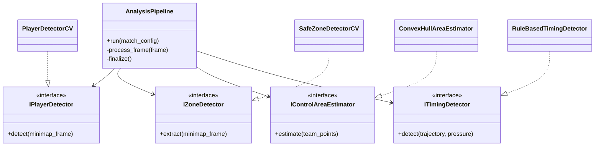
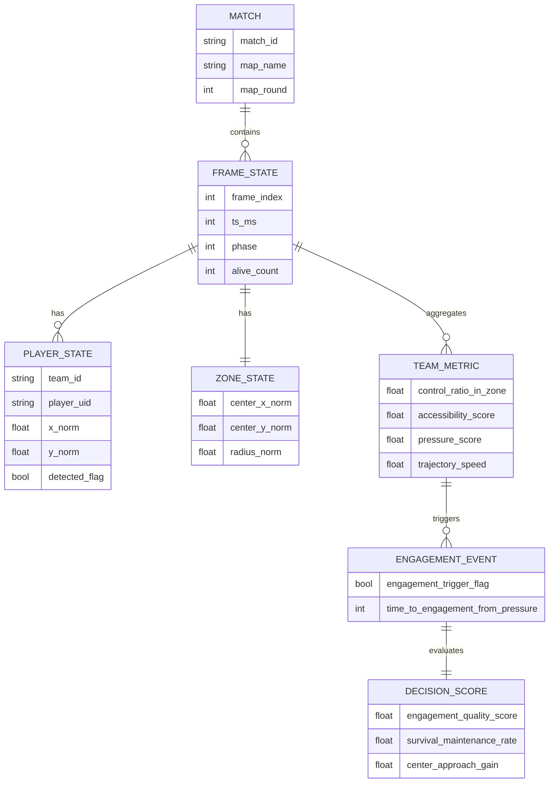
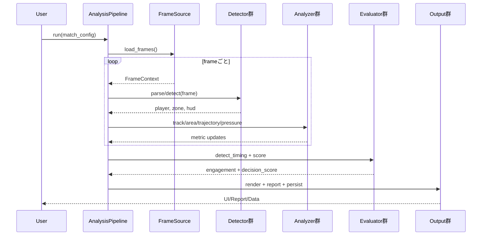

# MapSight_AI 基本設計書

## 1. 文書情報
- 文書名: MapSight_AI 基本設計書
- バージョン: V0_01
- 作成日: 2026-04-21
- 対応要件: `要件定義書_V0_01.md`
- 対象システム: PUBG試合映像のミニマップ解析に基づく戦術分析支援

---

## 2. 設計方針

### 2.1 小規模関数を組み合わせる方針
- 全機能は「入力検証」「前処理」「単機能計算」「集約」の4層に分割する。
- 1関数1責務を原則とし、関数名で入出力が推定できる粒度にする。
- 各分析器は**純粋関数に近い内部メソッド**を持ち、状態管理は上位クラスで行う。

### 2.2 OOP設計方針
- 検出器・分析器・評価器・描画器をクラスで分離する。
- 抽象インターフェース（Protocol/ABC）を介して依存注入する。
- 解析アルゴリズムを差し替える際は、実装クラスの交換のみで対応可能にする。

### 2.3 可観測性と失敗設計
- 各ステージで `start/end/duration/error_count` を構造化ログで出力。
- 欠損データは `ValidationError` として記録し、継続可能な処理は継続する。
- 復旧不能エラーは `PipelineAbortError` で明示的に停止する。

---

## 3. システム全体構成

```mermaid
flowchart LR
    A[FrameSource]\n連番画像入力 --> B[MinimapParser]
    B --> C[PlayerDetector]
    B --> D[SafeZoneDetector]
    B --> E[HudExtractor]

    C --> F[PlayerTracker]
    D --> G[ZoneStateBuilder]
    F --> H[ControlAreaEstimator]
    F --> I[TrajectoryAnalyzer]

    G --> J[PressureEvaluator]
    H --> J
    I --> K[EngagementTimingDetector]
    J --> K

    K --> L[DecisionQualityEvaluator]
    L --> M[OverlayRenderer]
    L --> N[TacticalReportGenerator]

    M --> O[(UI Output)]
    N --> P[(Report Output)]
    L --> Q[(Metrics Store)]
```

---

## 4. 主要コンポーネント設計

### 4.1 コンポーネント一覧
| コンポーネント | 役割 | 主な入力 | 主な出力 |
|---|---|---|---|
| FrameSource | フレーム列の供給 | 画像ディレクトリ | `FrameContext` |
| MinimapParser | ミニマップ領域切り出し | `FrameContext` | `MinimapFrame` |
| PlayerDetector | プレイヤーマーカー検出 | `MinimapFrame` | `DetectedPlayer[]` |
| PlayerTracker | player_idの時系列対応付け | `DetectedPlayer[]` | `TrackedPlayer[]` |
| SafeZoneDetector | 安全地帯/収縮領域抽出 | `MinimapFrame` | `ZoneState` |
| ControlAreaEstimator | チーム保持エリア算出 | `TrackedPlayer[]` | `ControlAreaState[]` |
| TrajectoryAnalyzer | 移動軌跡特徴算出 | `TrackedPlayer[]` | `TrajectoryMetrics[]` |
| PressureEvaluator | 逼迫度とアクセス指標計算 | `ZoneState` + `ControlAreaState[]` | `PressureMetrics[]` |
| EngagementTimingDetector | 仕掛けタイミング検知 | `PressureMetrics[]` + `TrajectoryMetrics[]` | `EngagementEvent[]` |
| DecisionQualityEvaluator | 判断品質スコア算出 | `EngagementEvent[]` + 試合結果 | `DecisionScore[]` |
| OverlayRenderer | UI重畳レイヤ生成 | 各解析結果 | 描画用レイヤ |
| TacticalReportGenerator | テキストレポート生成 | `DecisionScore[]` | markdown/jsonレポート |
| AnalysisPipeline | 全体オーケストレーション | 設定 + 入力パス | 一連の成果物 |

### 4.2 クラス依存関係


---

## 5. 機能要件トレーサビリティ
| 要件ID | 基本設計上の実装責務 | 主担当クラス |
|---|---|---|
| FR-01 入力管理 | フレーム列挙・timestamp付与・入力検証 | `FrameSource` |
| FR-02 ミニマップ状態抽出 | safe zone/HUD/抽出ログ | `MinimapParser`, `SafeZoneDetector`, `HudExtractor` |
| FR-03 プレイヤー位置検出 | 座標化、正規化、ID追跡 | `PlayerDetector`, `PlayerTracker` |
| FR-04 チーム保持エリア | 面積・中心・ゾーン内割合 | `ControlAreaEstimator` |
| FR-05 安全地帯関連指標 | 占有率・アクセス可能性・進入余地 | `PressureEvaluator` |
| FR-06 移動軌跡分析 | 軌跡長・速度・方向変化・停滞/急移動 | `TrajectoryAnalyzer` |
| FR-07 勝負タイミング検出 | 逼迫局面→移動/接敵/生存変化の連鎖検知 | `EngagementTimingDetector` |
| FR-08 判断品質評価 | 仕掛け後指標に基づくスコアリング | `DecisionQualityEvaluator` |
| FR-09 UI表示 | レイヤ合成と表示更新 | `OverlayRenderer` |
| FR-10 レポート出力 | データ中心の記述レポート | `TacticalReportGenerator` |

---

## 6. データ設計（基本）

### 6.1 論理データモデル


### 6.2 永続化フォーマット
- 中間データ: Parquet（時系列計算効率重視）
- 可視化連携: JSON（UI/レポート用）
- ログ: JSON Lines（可観測性重視）

---

## 7. 処理シーケンス設計

### 7.1 バッチ解析シーケンス


### 7.2 エラーハンドリング方針
- フレーム単位の抽出失敗は `FrameErrorRecord` を保存し次フレーム継続。
- 連続失敗率が閾値超過時は `PipelineAbortError` を送出。
- 失敗種別例: `ZONE_NOT_FOUND`, `PLAYER_DETECTION_EMPTY`, `HUD_OCR_FAILED`。

---

## 8. インターフェース設計

### 8.1 主要メソッド（抜粋）
- `FrameSource.iter_frames(input_dir) -> Iterator[FrameContext]`
- `PlayerDetector.detect(minimap_frame) -> list[DetectedPlayer]`
- `PlayerTracker.assign_ids(detections, previous_state) -> list[TrackedPlayer]`
- `ControlAreaEstimator.estimate(team_points) -> ControlAreaState`
- `PressureEvaluator.compute(team_state, zone_state) -> PressureMetrics`
- `EngagementTimingDetector.detect(pressure_series, trajectory_series) -> list[EngagementEvent]`
- `DecisionQualityEvaluator.score(pre_state, post_state) -> DecisionScore`

### 8.2 API境界（将来拡張）
- CLI: `mapsight analyze --config config.yaml`
- バッチAPI: `POST /analysis/jobs`
- 結果参照API: `GET /analysis/jobs/{job_id}/summary`

---

## 9. 非機能要件への設計反映
| 非機能要件 | 設計反映 |
|---|---|
| NFR-01 性能 | フレーム処理をステージ分割し、並列化可能な構造にする |
| NFR-02 保守性 | 小規模関数 + 単一責務クラス +明確な命名 |
| NFR-03 再利用性/拡張性 | インターフェースと依存注入で実装交換可能にする |
| NFR-04 信頼性 | 欠損を例外種別化しログ保存、継続/停止を明示 |
| NFR-05 可観測性 | 構造化ログ + メトリクス収集 + 進捗表示 |

---

## 10. 開発・バージョン運用方針
- 文書バージョンの運用は以下に従う。
  - 軽微変更: `V0_01 -> V0_02`
  - 大規模変更: `V0_01 -> V1_00`
- 基本設計から詳細設計へ進む際は、インターフェース互換性を維持する。
- 判定ロジック（FR-07/08）は複数アルゴリズムを並行評価できる構成を維持する。

---

## 11. 今後の詳細化ポイント
1. 検出器ごとの閾値設定・学習モデル採用方針の明確化
2. 仕掛けタイミングの教師データ定義
3. 判断品質スコアの重み最適化手順
4. UI表示更新頻度と操作性要件の確定
