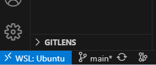

# task note

## 2025/05/15

### 開発環境の構築

14:45 ~ 15:19
・ChatGPTでのプロジェクト仕様の調査検討
・プロジェクトフォルダの構築
・開発環境（主にVim）の調査検討

### 　開発環境の構築の続き　+　画像抽出の自動化

18:06:05 ~　19:00
開発環境の構築
主にモジュールのダウンロードとインストールでむっちゃ時間を喰った．20分ぐらいはかかったと思う．

19:00~20:33:14
画像抽出プログラムの試作，
ＵＲＬリンクから動画を取得し，そこから画像抽出するプログラムを作成，スクリプトも書いたのでコマンドでの実行が可能に！
これまで処理に時間がかかっている．結構限界かも...
clean_same_framesも実行に時間がかかっている．
大量のデータ処理が開発におけるネックになるなぁ

取り敢えず待機画面の部分の削除はできた．4000軒ほどのデータ削除
よくわからんが高速化もできたみたい．

- clean_same_frames.py：MD5 → dHash → pHash → aHash と改良
- 並列処理＋削除ログ付き

## 2025/05/16

### 開発環境構築の続き・Github連携

13:35 ~ 14:38
git管理の導入．Github連携でつまずいている．
Dataは.gitignoreで連携無効にしているよ
連携は次はSSH接続を試すつもり

### 　Github連携・SSH接続

15:25 ~ 15:53
取り敢えず今はパスなし鍵で運用する．
今後システムを公開するようなことがあれば（誰か他の人に使ってもらうようなことがあれば）切り替えする．
sshpassだったりssh_agentの活用といったことを検討する．

SSH接続が完了した．

新しいリポジトリをcloneするときは SSHURLで取得する  
git clone <git@github.com>:username/SomeRepo.git  

リポジトリをHTTPSでcloneしてしまった場合⇒  
git-remote set-url-origin <git@github.com>:... でSSH　URLに変更  

16:00 ~ 16:47
github actionsとprojectの設定  
使えるようにした．  
今後作業に関してSlackに通知を出すとかが出来るようになるかも  

github actionsでbug.yaml/task.yaml/log.yaml　を実装するのがタスクとして残った．次の開発はこれ．

19:55 ~ 20:04
ISSUE＿TEMPLATE内の*.yamlを記述．プッシュ　　
これにより新しい実装・調査，日時メモ・記録，バグ記録が出来るようになった？
ISSUEの立て方に悩んだら安野さんの都知事戦の時の公開ISSUEみたいな奴を参考にしよう
[安野たかひろ，課題提起マニュアル（政策レポジトリ）](https://manifest.takahiroanno.com/manual_issue/)

## 2025/05/18

## [Task]マッチ単位でのフレーム分割に取り組む

17:59~ 18:54
> [!IMPORTANT]
>作業開始するときは仮想環境を起動させてからやろうね
> 作業開始コマンド  
> wsl terminalを起動
> source ~/pubgmapenv/bin/activate  

実行ファイルはsrcフォルダに格納したので，また後で再度実行テストをするときにPath関連でエラーが起きるかも...

ファイル参照と分類はできた．
自動的な分類だと精度がダメダメ
ここをチューニングするのは大変そうなので，
参考画像として試合終了時のフレームを与え，テンプレートマッチでの実装を次のタスクとして残して，今回の作業は終了．

試合区切り分類 - segment_rounds.py：
 ・aHash で類似度列 → ハミング距離ピーク
 ・テンプレートマッチで「試合終了」検出
 ・クラスタ統合 (--cluster-gap) & フレーム間引き (--step)

## [Task]segment_rounds.pyにおける依存関係の解消 #6

pip install の実行
requirement.txtへの追記を行った．

## [Task]マッチ単位でのフレーム分割part2

19:20 ~ 19:37  
テンプレートを用いた分類を実装して，その実行まで行った．  
結構時間がかかりそうなので休憩に入る．  
多分長くて２０分ってところかな

ISSUEも1つ追加しておいた．

## 2025/05/19

### [Task]マッチ単位でのフレーム分割 part3

14:25　~ 15:00
前回に続きフレーム分割に取り組む．
前回のテストでテンプレート画像とのマッチングは確認出来たので，それを用いたグループ分けの取り組みになるな．
テンプレートと同じ画像が数枚連続しているから，それを消去するかどこかに吸収させないといけない．
境界探索には実行に15分程度かかる

実行時間の間は技術調査というかお勉強をします...
同一画像検知アルゴリズムのお勉強を...

今回は取り敢えず動かしたいのでahashを採用します．

## 2025/05/20

### [Task]マッチ単位でのフレーム分割の続き

14:43~
hdist関数の追加，detect_template_frames()のNumPy配列への対応．

15:09~ 15:11:
テスト
実装ミス（スペルミス）が発覚，修正
誤）unit8 正）uint8

15:11~ 15:33
実行テスト　あまりに長いので途中で止めた．
軽量化を試しながら．．
なんか問題としてcv2が上手くインポートできていないような気もするけど...
opencvはちゃんとインストールできているからなぁ．．．よくわからん．

軽量化を試す．
テンプレート検出も並列に実行指せる．クラスタ代表だけ採用

segment_rounds.pyに--stepオプション追加

16:01
もろもろ修正を加えて，実行テスト

やっぱり環境が悪さしてそう．
仮想環境の構築からやり直しか？？？

## 2025/05/23

### [frames取得時のフレームレートの設定](https://github.com/tomoya-mizutani/MapSight_AI/issues/9)

16:00 ~ 16:10
FPSの値を0.5に変更した．
2秒に一回マップ状況を取得するように変更した．

### [仮想環境の構築 #10](https://github.com/tomoya-mizutani/MapSight_AI/issues/10)

16:39 ~ 16:41

プロジェクト直下に.venvを新規追加．
前回のドキュメントを読んでた．．．

18:47 ~　19:22
Pylanceとの相性の悪さを解決したい．．．
Docker等の導入を考えているが，なかなかうまくいかない

## 2025/05/24

### [仮想環境の構築](https://github.com/tomoya-mizutani/MapSight_AI/issues/1)  

00:19
Vscodeのwsl接続をDocker-DeskTopからUbuntuに明示的に変更する．
ということでWSL:Ubuntuで開発出来ることになった．
なんか拡張機能の追加をまたしないといけないような気がする．．．．

VScodeのインタープリターがpubgmapenvになっていなかったぽい．
インタープリターを仮想環境に設定しなおしておいた．

問題の部分にもモジュールの解決できないというやつはなくなった．

00:50~ 01:30  
実行テスト，実行できた！！！！
終わったタイミングを見逃したから，気付いたタイミングが30分だっ

#### ドキュメント作成

10:22 ~ 10:24
仮想環境の構築について  
1.WSL接続先をDockerDeskTopからUbuntuに変更  
2.Pythonインタープリターを手動で再設定  

これによってちゃんとPylanceもvenvを参照してくれるようになった  

### ISSUEの追加

Detective_templateの最適化です．

### [Segment_Rounds.pyにおける速度改善](https://github.com/tomoya-mizutani/MapSight_AI/issues/11)

12:00 ~ 12:17
実行テスト
まぁ実行時間が半分ぐらいになったのは良いね．
並列処理の導入した．
あとは追加で実行時間計算ログ出力・CLI実行時の進捗表示も追加．
GPUは取り敢えず今は断念．本番環境では導入したい．

## [framesのトリミング自動化](https://github.com/tomoya-mizutani/MapSight_AI/issues/7)

22:52 ~ 23:42
map配信の中から必要な部分のみを抽出．
切り抜き箇所はconfig.yamlを参照．
crop_minimap.pyが実行ソースコード
少しだけパスとかそこら辺を修正して実行テストに移る．

23:02 ~  23:24
実行テスト
15977/15977 [22:30<00:00, 11.83it/s]
Done: 15977 images

実行に22分もかかってしまってはいるが，まぁ良いだろう...
取り敢えずは実行できたし...
実行コマンド:python src/crop_minimap.py

crop_minimap.pyにドキュメントを追加した．
後はコードリーディングを行い，処理の流れを追った．
おわり！！

## タスク整理

11:40 ~ 00:09
タスク整理を行った．
Github Project の活用とISSUEの追加を行った．
Logも残してみた．

## [ディレクトリ構造図の作成](https://github.com/tomoya-mizutani/MapSight_AI/issues/16)

22:03 ~ 23:01
Issue#16に取り組む．
README.mdにディレクトリ構造図を追加

拡張機能:Markdown Preview Mermaid Supportを追加  

結局Mermaidは使わずにAscii artでやることにした．  
Github Actions Workflowを用いたCI/CDを取り入れる  
treeコマンドでASCII treeをREADME.mdに自動更新を欠ける形にした.  
.github/workflows/update-tree.ymlに記述  
git push 実行時にgithub Actionsが動いて自動更新かかる．  

git fetch origin
git rebase origin/main  
が必要な時もある.  

> [!IMPORTANT]
>作業開始するときに自動更新のせいでgitのバージョンがずれている可能性がある．
> そういう時は以下のコマンドを実行して作業開始
> git fetch origin #最新のリモートをフェッチ
> git rebase origin/main #リモートのmainブランチをローカルにリベース

## 2025/05/26

### [画像学習・予測モデルの調査](https://github.com/tomoya-mizutani/MapSight_AI/issues/4)

調査内容は[survey.md](./survey.md#画像学習予測モデルの調査)　に記述
どういった予測モデルが使えるか・システム全体の構想を考える．
何をどうやって学習するか・予測するかを考えないといけない．
参考事例として，サッカーでの予測モデルを取り上げている．

と思ったけど，モデルの調査をする前に結局データの整備の方が重要性が高そうなので，そちらに取り組んだ方がいいね．

### [画像自動取得のフォルダ参照先解決](https://github.com/tomoya-mizutani/MapSight_AI/issues/8)

extract_frames.shを修正した．
./frames ⇒　data/frames
ディレクトリ階層の変化に対応

### [マッチ単位でのフレーム分割](https://github.com/tomoya-mizutani/MapSight_AI/issues/2)

segment_rounds.py　の対象フォルダをminimapにして実行テスト

## 2025/06/01

### Cursorの導入

開発環境としてCursorを導入した．Agent機能の強さを実感している．

### GUIの作成

Cursorを使用してGUIのモックアップの作成をした．
まだ動いていないけど，ディレクトリ構築からドキュメント生成・複数ファイルの生成など思った板よりできることが幅広くてびっくりしている．

## 2025/06/04

### GUIの改善

16:10 ~ 16:35
メニューバーの文字化け対策を行っている（Cursorが...）
日本語表示についてはJAPANESE_SUPPORT.MDにかいてある．
ドキュメントも結構丁寧に書いてくれる．後から読もう．
フォントのインストールもしました

## 2025/06/06

### 画像ファイル取得テスト

11:35 ~ 12:00

別の動画ファイルでFPS:0.5で実行
生成された画像ファイルは5000程度
結構軽めに動いた．

## 2025/06/09

### タスク確認とフォルダ整理

10:30 ~ 11:00

今日開発する機能の確認と必要無くなった画像フォルダを削除する
新たにＦＰＳ：０．５　で取得したデータが活用できそうなので今まで使っていたデータは削除した．
frames/, minimaps/deleted_frames/直下に保存されていたものを消した．
これからは新たに　各ディレクトリ直下に \<upload data>フォルダを生成して，その中に配置するようにする

これからどうやってタスクをISSUEとしてCodexに渡せるようにするかが課題となるな
Issueとして機能を分解していくためには，これから作っていくシステムの理解が足りない...

### 画像処理

18:10 ~ 

### タイムスタンプの扱い方．

生成された画像データにタイムスタンプを付けるかどうか❓
データ取得時はつけない（その後ラウンド後に分割，余計な部分の削除とかでタイムスタンプがずれてくる部分が発生するため）
ラウンドごとのファイルに振り分けられたとき，ファイル名をまた001からスタートさせる
そのファイル名と画像データ取得時のフレームレートを対応させて，タイムスタンプを復活させる．

先に必要のない画像を全て消してから，Roundごとの分類をやったほうが精度上がるかなぁ

## 2025/08/28

久々に再開した．PMJLも始まるので一気に開発をおわらせよう．

## 2025/09/22 月

@home
05:17
二カ月ぐらい時間が空いたけど，また開発を再開する
開発タスクを
データ収集，データ成形，データ抽出，モデル開発，予測タスク
という感じに分けて，やっていくことにする．

今まではデータの収集とデータの成形を一気にやろうとしてつまずいていた．

試合ごとの分割データを取得するよ
まずはエランゲルかなぁ
frame02928.jpg ~ frame04652.jpg : Erangel1
frame04982.jpg ~ frame06669.jpg : Erangel2
frame00801.jpg ~ frame02385.jpg : Rondo
frame07049.jpg ~ frame08852.jpg : Miramar1
frame09187.jpg ~ frame10935.jpg : Miramar2

ぐだぐだやって06:00かな
for i in $(seq -w 02928 04652); do cp "frame_${i}.jpg" Erangel1/; done
正規表現を使ったCLIコマンドでファイルコピーする方法を取った．
フォルダは先に作っておいた．

08:53 ~ 09:40
位置データの抽出に取り組む．
データ構造の設計をしないといけないかな

例えば...を
データ設計.mdに書いておいた．
それをプロンプトにChatGPTに出力させている．Sample画像は13件与えてある．．．

https://chatgpt.com/g/g-p-68257dddb7348191901b230f81b3cd05/c/68d09234-19b0-8333-a1bf-6a2c1b96c099

これが対話ログ
出力内容を読んだのと，ディレクトリ構築をしていた．
あとはサブタスクとしてスマホでCodexの環境構築ができないかと四苦八苦していた．

## 2025/09/24 水

10:10　~ 10:24
今までの作業メモを読み直すところから着手する
今日の目標は
サンプル出力させたデータの確認とそれを使った可視化ツールの作成かな
可視化は選手の移動とかを見えるようにしたいって感じかな，
UIはまた考えないといけないけど．，．．

どうせ，いつかぶつかる問題として，座標の変換がある．
スクリーンショットは安地が小さくなるにつれ，その内部の情報だけを表示するために，フェーズが進むごとに拡大表示されている．
従って，座標もそれに合わせて変換していかないといけない...
どうやるんだろう．．
第1フェーズから第2フェーズ...最終フェーズまで，断続的に安地のサークル（白線のもの）自体は追跡できるので，それを基に平行移動やらなんやらを繰り返せば何とかなるかも...

このタスクは午後に2時間ぐらい集中して取り組めば，何とかなりそう？？？
テストデータがしっかりと用意出来たら...にはなるけど...

簡単な記録と作業のウォーミングアップをした．

## 2025/09/29

毎日開発に取り組むのが一番難しいね．

11:40 ~ 12:10
取り敢えず30分でCodexにタスク投げつけるところまでやる

前回の開発で作ったサンプルプログラムの出力検証方法について検討する．
bashの"jq"コマンドを使えるようにした．aptインストールをした．

30分かけて前回のサンプルプログラムをもう一度動かすところまでやった．
休憩しちゃおう

気付いたら30分ぐらい休憩しちゃった．

12:45 ~ 13:06
再開
gpt-5-codex(high)にプレイヤーの行動の軌跡を可視化するプログラムの作成をお願いして終わり．

散歩に行ったり休憩入れてたら，いつの間にか16時になっていた．．

16:00 ~ 

さっきのCodexに投げていたタスクが完了していたので，それのチェックをする
reviewっぽくできたらいいよなぁ

出力概要(by GPT-5)

Added mapsight/analysis/player_tracking.py:32-281 introducing canonical player identifier handling, load_player_positions, the PlayerTrajectory helper, path-length metrics, and a plotting routine that can render normalized or pixel trajectories (with optional map overlays).
Published a CLI at tools/player_tracking_analysis.py:1-132 that loads JSONL/Parquet exports, prints a configurable summary, and saves or shows trajectory plots—for example: python3 tools/player_tracking_analysis.py --positions data/positions/2025-09-18/Erangel1/positions.jsonl --player Team1player1 --team-id TEAM01 --player-slot P1 --output output/trajectory.png.
Added regression coverage in tests/test_player_tracking.py:17-126, validating flexible player lookups, summary metrics, and figure generation (using an Agg backend to keep plotting headless-friendly).
Testing

❌ python3 -m pytest tests/ (fails: ModuleNotFoundError: No module named pytest – the sandbox Python environment lacks pytest)
Next Steps

Install project dependencies (at minimum pytest) and rerun python3 -m pytest tests/ to verify the new suite.
Provide a real minimap image via --map-image when running the CLI to review the plotted trajectory against in-game geography.

## 2025/09/30

test用のデータを作成する
開発用にGithubに置いておくためのディレクトリを追加
test/data/
にminimaps,positionsを配置

## 205/10/01

13:00~　14:20
昨日，出力してもらったコード内容を読んでいた．
ついでにそれをプルリクしてマージしといた，次はテストが待っている．
test workflowをminimap_pipeline_worklogに追加させた．

Pythonの静的検証ツールflake8を導入した．
何がどうなっているかはまた記事を読んでおくよ
今回作成したやつだとE501エラー：1行での文字数オーバーが検出された．
それはコードが読みにくくなったりして，レビューとかバグ調査が難しくなることがあるらしい，
後はエディターとかのレイアウトがうまくいかなくなったりする可能性もあるとか．．．

pytestを実行してみた

よくわからんから，あとでまた勉強しないといけないね．

プログラムの実行を試みたがうまくいかなかった．
なんか出来上がっていたプログラムが期待しているものと違ったっぽい？

元々プレイヤーの位置情報を抽出するのに，特にテンプレートとかを使うつもりじゃなかった．
なんか知らんけど，いけるやろ　みたいな気持ちでいた．
GPT君はHSVかテンプレートでやらないと無理という判断で，テンプレートを使った実装をしてきたのかな．

こっちとしてはプレイヤーのテンプレートとかは用意していないし...
そもそも，実装で扱われたテンプレートが何なのか？を理解できていない．．．
